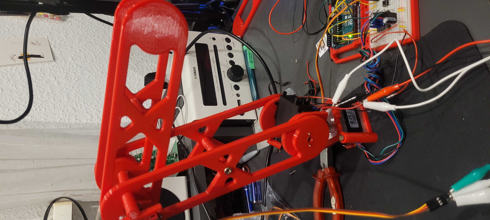

# 2 Segment Robotic Arm with simple IK

*This is a project i made to learn the basics of PyQt, CAD design and motor control. I am sharing it simply to share it, not for it to be recreated (You wouldn't want to).*

## About:

This is a simple, mostly 3D printed 2 Segment Robotic Arm. Coordinates are inputed via the desktop programm, made using PyQt5, Serial for communicating with the arm and matplotlib to visualize the arms position. The coordinates are sent to the arms Arduino UNO R3 as a string, parsed and used to calculated the motors angles. The Servos use the ServoEasing library to allow for smooth movement, the Nema17 Stepper motor is controlled using a Custom Wrapper of the popular AccelStepper library and a Bigtreetech TMC2209 Motor Driver.

Setting up the software side is (as much as I feel like it) explained in this Github Repo, the arm itself along with the models are on Printables here : **PLACEHOLDER**

*note: Im unfamiliar with sharing software like this, you will need to install the required libraries mannually, ill try to remember to name them, or just look through the code to find them.*

 

### Setting up the Arduino
The Arduino Code uses a custom Wrapper library to expand Accelstepper to work with degrees. Thats why the library files "motor.h" and "motor.cpp" need to be in the same folder as the .ino sketch file. From there uploading the sketch using the Arduino IDE should work fine. *BE CAREFULL:* Whenever you upload the Sketch or establish a serial connection, the Servos might move rapidly to their starting position, as is unavoidable with the ServoEasing library without fancy save funtions. Make sure you hold the motor secure!

